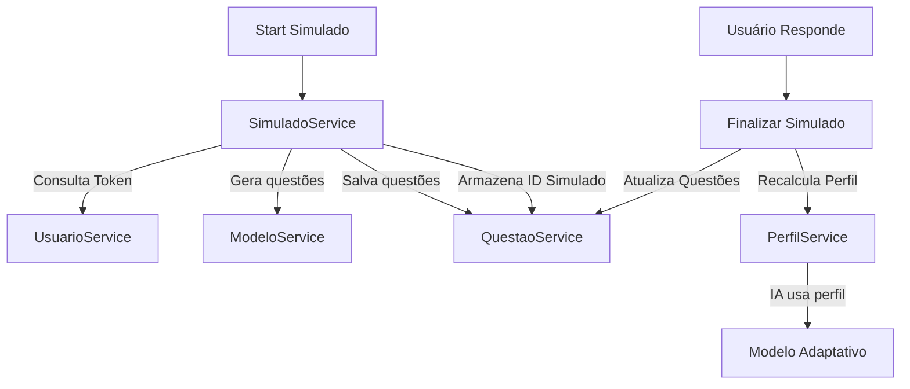

# 📝 Microserviço de Simulado — BrainWin

Este serviço é responsável pela **gestão dos simulados** na plataforma BrainWin, tanto no formato **Adaptativo** quanto **Original**. Ele realiza o controle de início, finalização, histórico e cobrança de wins do aluno.

É o serviço que **orquestra** a comunicação entre os microserviços de:
- ✅ Usuário → Validação e débito de wins
- ✅ Questões → Criação e atualização das questões do simulado
- ✅ Perfil → Atualização do perfil de aprendizado do aluno após a finalização

---

## 🚀 Visão Geral

O microserviço de Simulado provê:

✅ Criação de simulados adaptativos e originais  
✅ Listagem e histórico por usuário  
✅ Finalização com recálculo total do perfil do aluno  
✅ Débito automático de wins ao iniciar  
✅ Manutenção de integridade de dados com outros serviços  

Simulado é sempre vinculado ao aluno via `id_usuario` e pode estar em estado:
- `ABERTO`
- `FINALIZADO` ✅ obrigatório para criar outro simulado

---

## 🔄 Fluxo Geral da Solução



---

## 🏛️ Arquitetura da Solução

- Spring Boot 3.4  
- MongoDB Atlas (Replica Set)  
- JWT (Auth via microserviço de Usuário)  
- Comunicações REST com:
  - Questões
  - Perfil
  - Usuário
  - Modelo Adaptativo

📌 Tipos de comunicação:

| Microserviço | Relação |
|------------|---------|
| Usuário | Debita wins e obtém dados do aluno |
| Questões | Cria e atualiza questões do simulado |
| Perfil | Atualiza perfil após finalização |
| Modelo | Gera módulo adaptativo |

---

## ⚙️ Instalação e Configuração

### ✅ Requisitos

- Java 21+  
- Maven 3.9+  
- Conexão com MongoDB (Atlas ou local)

### 🔌 Variáveis de Ambiente / `application.properties`

```properties
spring.data.mongodb.uri=${MONGO_URI}
spring.data.mongodb.database=brainwinTest

api.usuario.base=http://localhost:8080
api.questao.base=http://localhost:8082
api.perfil.base=http://localhost:8083
api.modelo.base=http://localhost:8085

jwt.secret=${JWT_SECRET}
jwt.expiration-ms=86400000
```

### ▶️ Executando

```sh
mvn clean package
java -jar target/simulado-0.0.1-SNAPSHOT.jar
```

Servidor inicia em:  
📍 `http://localhost:8081`

---

## 📡 Principais Rotas

| Método | Rota | Auth | Descrição |
|---|---|:---:|---|
| POST | `/simulados/adaptativo` | ✅ | Inicia simulado adaptativo |
| POST | `/simulados/original` | ✅ | Inicia simulado tradicional |
| PUT | `/simulados/finalizar` | ✅ | Finaliza simulado + recalcula perfil |
| GET | `/simulados/{id}` | ✅ | Buscar simulado por ID |
| GET | `/simulados` | ADMIN | Listar todos |
| GET | `/simulados/usuario/{idUsuario}` | ✅ | Histórico do aluno |

📝 Exemplo Finalizar Simulado:
```json
{
  "id_simulado": "ab12cd34",
  "id_usuario": "xyz100",
  "tipo": "ADAPTATIVO",
  "data": "2025-10-18T14:55:00",
  "status": "FINALIZADO",
  "fatura_wins": 5,
  "questoes": [
    {
      "id": "q987",
      "topic": "Matemática",
      "subskill": "Aritmética",
      "alternativa_marcada": "B",
      "dica": false,
      "solucao": true
    }
  ]
}
```

---

## 🧱 Estrutura do Projeto

```plaintext
ai_startup_simulado/
│
├─ src/main/java/ai/startup/simulado
│  ├─ auth/
│  │  └─ JwtService.java
│  │
│  ├─ security/
│  │  └─ SecurityFilter.java
│  │
│  ├─ simulado/
│  │  ├─ SimuladoController.java
│  │  ├─ SimuladoService.java
│  │  ├─ SimuladoRepository.java
│  │  ├─ Simulado.java
│  │  ├─ SimuladoDTO.java
│  │  ├─ SimuladoCreateDTO.java
│  │  ├─ SimuladoUpdateDTO.java
│  │  └─ FinalizarSimuladoRequestFlat.java
│  │
│  ├─ clients/  # integração com outros MS
│  │  ├─ UsuarioClient.java
│  │  ├─ QuestaoClient.java
│  │  ├─ PerfilClient.java
│  │  └─ ModeloClient.java
│  │
│  └─ SimuladoApplication.java
│
└─ pom.xml
```

---

## ✅ Status

| Recurso | Status |
|--------|:-----:|
| Iniciar simulado com débito de wins | ✅ |
| Finalizar simulado e atualizar perfil | ✅ |
| Fila de simulados abertos por usuário | ✅ |
| Integração com Questões e Perfil | ✅ |
| Segurança com JWT | ✅ |
